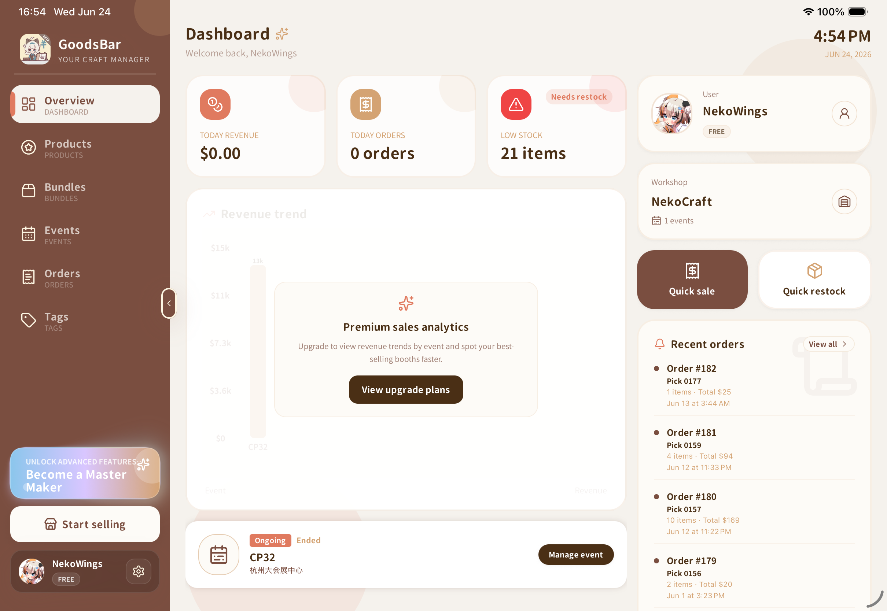

# GoodsBar Showcase

The public product and engineering showcase for **GoodsBar**, an offline-first iPad POS and inventory workspace designed for independent convention sellers.

**Live site:** `https://nekowings.github.io/goodsbar-showcase/` (available after the repository is published and Pages is enabled)

**App Store:** [GoodsBar (international)](https://apps.apple.com/th/app/goodsbar/id6753799200?platform=vision) · [谷子吧（中国大陆）](https://apps.apple.com/cn/app/%E8%B0%B7%E5%AD%90%E5%90%A7-%E6%91%86%E6%91%8A%E8%AE%B0%E8%B4%A6%E5%BA%93%E5%AD%98%E5%B0%8F%E5%8A%A9%E6%89%8B/id6753799200)



## What this site covers

- An interactive route map from catalog preparation through event selling and order review
- Product capabilities including inventory-aware bundles, promotions, gifts, LAN picking, backup and multilingual checkout
- An engineering case study covering React Native, Expo Router, Zustand, Drizzle ORM, SQLite, Swift and Kotlin
- A bilingual English and Simplified Chinese presentation
- A concise, copyable résumé summary

All screenshots use demonstration data. The showcase intentionally excludes production source code, credentials, private analytics, payment configuration and operational secrets.

## Technology

React, TypeScript, Vite, Tailwind CSS, Lucide icons, GitHub Actions and GitHub Pages. The site is fully static and has no backend, tracking scripts or cookies.

## Local development

```bash
npm install
npm run dev
```

Quality checks:

```bash
npm run lint
npm run typecheck
npm run build
npm run preview
```

Vite uses `/goodsbar-showcase/` as its production base path so assets work correctly on project GitHub Pages. Local development remains available at the URL printed by Vite.

## Publishing

1. Create a public GitHub repository named `goodsbar-showcase`.
2. Push the local `main` branch to it.
3. In **Settings → Pages**, set the source to **GitHub Actions**.
4. The included workflow verifies lint, build, and links before deploying `dist/`.

## Updating content

- Localized interface copy: `src/content/copy.ts`
- Route graph, features, metrics, and engineering highlights: `src/content/data.ts`
- Shared content contracts: `src/content/types.ts`
- Public demonstration images: `public/screenshots/`

English and Chinese content share TypeScript contracts, so missing structural content is caught during the build.

## License

Copyright © 2026 NekoWings. All rights reserved.

The showcase source and GoodsBar visual assets are provided for portfolio viewing only. No permission is granted to redistribute, resell, or represent the product or assets as your own.
